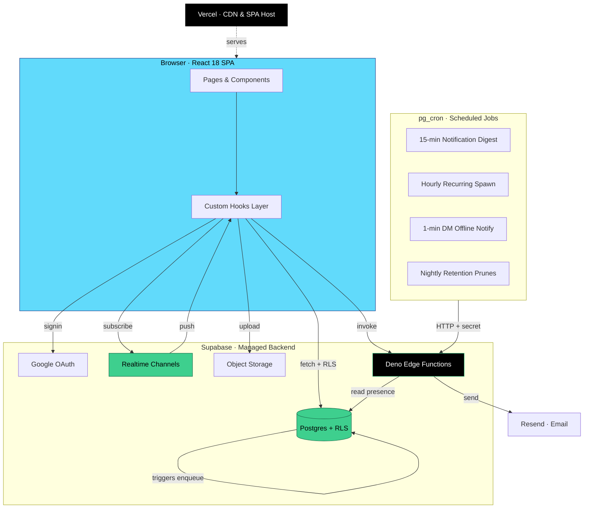
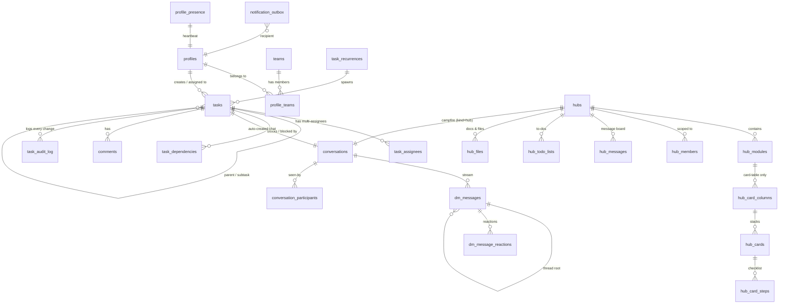

<div align="center">


# Project Engine

### The collaboration OS for distributed teams.

*Task management, project hubs, real-time chat, and notifications — built as one unified workspace.*

<br />


<br />


<br />

**Built and maintained by [Ian Anunciacion](https://github.com/adminhypr) · Sole Developer**

</div>

---

## Table of Contents

- [What is Project Engine?](#what-is-project-engine)
- [Highlight Reel](#highlight-reel)
- [Feature Matrix](#feature-matrix)
- [Architecture at a Glance](#architecture-at-a-glance)
- [Data Model Snapshot](#data-model-snapshot)
- [Realtime &amp; Notification Pipeline](#realtime--notification-pipeline)
- [Role &amp; Permission Model](#role--permission-model)
- [Tech Stack](#tech-stack)
- [Local Development](#local-development)
- [Project Layout](#project-layout)
- [Engineering Highlights](#engineering-highlights)
- [Credits](#credits)

---

## What is Project Engine?

> A purpose-built internal collaboration platform that replaces the typical patchwork of Asana + Slack + Basecamp + Google Drive for a single distributed organization.

Users sign in with Google, get assigned a role (Staff, Manager, or Admin) plus optional external roles (Agent, Client), and step into a single workspace that tracks **tasks**, runs **project hubs** (Basecamp-style collaboration rooms), powers **direct messaging + group chat**, and pushes **real-time notifications** — all backed by Supabase Postgres with Row-Level Security on every table.

The whole stack is deliberately small: a React 18 SPA, a Postgres database with `103` migrations (every business rule is in SQL or RLS), and a handful of Deno edge functions for offline-aware email digests and recurring task spawning.

---

## Highlight Reel

<table>
  <tr>
    <td width="50%" valign="top">

### Live Priority Engine
Task urgency is **never stored**. Red / orange / yellow / green is computed at read-time from due-date deltas and last-activity timestamps. Stale tasks self-promote to red after 36h of silence; no cron required.

  </td>
  <td width="50%" valign="top">

### Presence-Aware Email
The notification **bell stays real-time** for every event. Email is reserved for *offline* users only and batched into a **15-minute digest** via a Deno cron — no inbox fatigue when the user already saw it in-app.

  </td>
  </tr>
  <tr>
    <td width="50%" valign="top">

### Basecamp-Style Hubs
Each hub is a free-flow 3-column grid of first-class modules: **Campfire** chat, **Message Board**, **To-Dos**, **Docs &amp; Files**, **Card Table** (kanban). Admins curate the canonical layout; every user can drag their own override on top.

  </td>
  <td width="50%" valign="top">

### RLS-Hardened by Design
Visibility, edit rights, and external-user scoping are enforced **in Postgres**, not the client. SECURITY DEFINER helper functions like `can_user_see_task()`, `is_hub_member()`, and `is_team_manager_or_leader()` break recursion cycles while keeping every read provably safe.

  </td>
  </tr>
  <tr>
    <td width="50%" valign="top">

### Threaded DMs &amp; Group Chat
Slack-style **threads**, quote-replies, **emoji reactions**, typing indicators, per-participant read receipts, and `@mention` auto-enrollment — all riding on a single `conversations` table that also powers task chat and hub Campfires.

  </td>
  <td width="50%" valign="top">

### Recurring Tasks, Done Right
A single edge function (`spawn-recurring-tasks`) is the **authoritative writer** for recurring task instances. Atomic spawn via an advisory-lock RPC prevents double-spawning under cron overlap, even if the worker crashes mid-transaction.

  </td>
  </tr>
</table>

---

## Feature Matrix

| Module | What it does | Key tables &amp; helpers |
|---|---|---|
| **My Tasks** | Personal task inbox: priority-sorted, filterable, with quick acceptance &amp; status moves | `tasks`, `task_assignees`, `getPriority()` |
| **Assign a Task** | Create tasks for self / superior / peer / cross-team / upward, with multi-assignee &amp; sub-tasks | `getAssignmentType()`, `tasks.parent_task_id` |
| **Team View** | Manager / Admin view of every assigned team's workload | `profile_teams`, RLS scoped to membership |
| **Reports** | Recharts dashboards: throughput, urgency mix, audit trails, CSV export | `task_audit_log`, `papaparse` |
| **Admin Overview** | Cross-team rollup with team / role grouping | RLS-aware aggregates |
| **Settings** | User &amp; team management, multi-team membership, per-team roles, Internal vs External team division | `profile_teams`, `teams.kind` |
| **Project Hubs** | Independent or team-scoped collaboration spaces | `hubs`, `hub_modules`, `hub_module_user_layout` |
| **Campfire (hub chat)** | Always-on hub chat, unified onto the `conversations` stack | `conversations` `kind='hub'` |
| **Message Board** | Threaded posts, inline images, `@mention` autocomplete | `hub_messages`, `hub_mentions`, `RichInput` |
| **To-Do Lists** | Named lists with drag-sortable, multi-assignee, commentable items | `hub_todo_lists`, `hub_todo_items` |
| **Card Table** | Basecamp-style kanban with per-card subtask checklist &amp; comments | `hub_card_columns`, `hub_cards`, `hub_card_steps` |
| **Docs &amp; Files** | Hub-scoped folder hierarchy backed by Supabase Storage | `hub_files`, `hub-files` bucket |
| **Direct Messages** | 1:1 + group chat with threads, reactions, replies, presence | `conversations`, `dm_messages` |
| **Task Chat** | Every task gets its own conversation, auto-seeded with assigner + assignees | `conversations` `kind='task'` |
| **Notification Bell** | Real-time in-app feed for assignments, mentions, comments | `notification_outbox`, realtime channel |
| **Email Digest** | 15-min batched email for offline users only (per-user opt-out) | `notification-digest` cron + `profile_presence` |
| **Recurring Tasks** | `day/week/month × every N` template spawning, deactivates on invalid assignees | `task_recurrences`, `spawn_recurrence()` RPC |
| **Audit Log** | Immutable history of every status / assignment / acceptance change | `task_audit_log`, write-only triggers |

---

## Architecture at a Glance



**Design principles:**

1. **Truth lives in Postgres.** Every business rule that matters is a CHECK constraint, RLS policy, or trigger. The client is a thin renderer.
2. **One realtime channel per concern.** Tasks, DMs, hub chats, and presence each get a single global subscription; no fine-grained per-row sockets.
3. **Email is the last resort.** Bells fire for everyone in-app; email only chases people who weren't there to see it.
4. **Migrations are append-only history.** No squashing, no rewriting — every fix lives as its own file with full context in the docstring.

---

## Data Model Snapshot



> The `conversations` table is **polymorphic by `kind`**: a single chat backbone powers DM threads, hub Campfires, and per-task chats. The `comments` table is similarly polymorphic across `task_id` and `card_id`. Both have CHECK constraints guaranteeing exactly one parent is set.

---

## Realtime &amp; Notification Pipeline

```mermaid
sequenceDiagram
    autonumber
    actor User as User A
    participant Client as React SPA
    participant DB as Postgres
    participant RT as Supabase Realtime
    participant Out as notification_outbox
    participant Cron as pg_cron · 15min
    participant Digest as notification-digest
    participant Resend as Resend Email

    User->>Client: post comment / send DM / mention
    Client->>DB: INSERT (RLS-checked)
    DB->>Out: trigger enqueues row (skips self)
    DB->>RT: postgres_changes event
    RT-->>Client: bell &amp; thread update (all online users)
    Note over Client: realtime delivery, no email yet

    Cron->>Digest: HTTP POST (X-Webhook-Secret + Bearer)
    Digest->>DB: atomic UPDATE … claimed_at=now() RETURNING
    Digest->>DB: check profile_presence.last_seen_at
    alt user is offline + opted-in
        Digest->>Resend: send digest
        Resend-->>Digest: ok
        Digest->>DB: mark emailed_at = now()
    else user is online
        Digest->>DB: mark emailed_at (skip — they saw the bell)
    end
```

Every cron-driven function authenticates with both a Bearer token (Supabase gateway requirement) and an `X-Webhook-Secret` header sourced from Supabase Vault — a defense-in-depth pattern that closed a real production gap (migrations 081 → 095 → 096).

---

## Role &amp; Permission Model

```
┌──────────────────────────────────────────────────────────────┐
│                       GLOBAL ROLES                           │
├──────────────────────────────────────────────────────────────┤
│  Admin     ★  Full access. Sticky — never auto-downgraded.   │
│  Manager   ✦  Set per-team or as global rollup.              │
│  Staff     •  Default; sees own + assigned work.             │
│  ─────────────────────────────────────────────────────────   │
│  Agent     ⌂  External. Sees only invited hubs.              │
│  Client    ⌂  External. Sees only invited hubs.              │
└──────────────────────────────────────────────────────────────┘

┌──────────────────────────────────────────────────────────────┐
│                    PER-TEAM ROLES                            │
├──────────────────────────────────────────────────────────────┤
│  Manager      ✦  Manager scope on this team only.            │
│  TeamLeader   ◆  Above Staff, below Manager.                 │
│  Staff        •  Default per-team role.                      │
└──────────────────────────────────────────────────────────────┘
```

| Capability | Staff | TeamLeader | Manager | Admin | Agent / Client |
|---|:---:|:---:|:---:|:---:|:---:|
| See own tasks &amp; tasks assigned to them | ✓ | ✓ | ✓ | ✓ | ✓ (if visible) |
| See whole team's tasks |   | ✓ | ✓ | ✓ |   |
| Assign tasks cross-team |   |   | ✓ | ✓ |   |
| Manage users on their team |   | ✓ | ✓ | ✓ |   |
| Create / delete teams |   |   |   | ✓ |   |
| Create hubs | ✓ | ✓ | ✓ | ✓ | ✗ (blocked at RLS) |
| Invited into specific hubs | ✓ | ✓ | ✓ | ✓ | ✓ |
| Reports access |   |   | ✓ (own teams) | ✓ (all) |   |

Self-privilege escalation is **structurally impossible**: a `BEFORE UPDATE` trigger on `profiles` rejects any self-update that touches `role`, `team_id`, `reports_to`, or `email` — no matter what RLS would say.

---

## Tech Stack

<table>
<tr>
<td valign="top" width="33%">

#### Frontend
- **React 18** — UI framework
- **Vite 5** — dev server + build
- **React Router 6** — SPA routing
- **Tailwind CSS 3** — utility styles
- **Framer Motion** — animations
- **TipTap 3** — rich text + `@mentions`
- **`@dnd-kit`** — drag-and-drop
- **Recharts** — analytics charts
- **`lucide-react`** — icon set
- **`date-fns`** — date math
- **`papaparse`** — CSV export
- **`dompurify`** — XSS sanitization

</td>
<td valign="top" width="33%">

#### Backend
- **Supabase** — Postgres + Auth + Realtime + Storage
- **PostgreSQL** — single source of truth
- **Row-Level Security** — every table
- **SECURITY DEFINER RPCs** — atomic ops
- **`pg_cron`** — scheduled jobs
- **Supabase Vault** — secret storage
- **Deno Edge Functions** — serverless
- **Resend** — transactional email

</td>
<td valign="top" width="33%">

#### Infra &amp; Tooling
- **Vercel** — production hosting
- **Vitest** — unit testing
- **React Testing Library** — DOM tests
- **jsdom** — test environment
- **ESLint** — linting
- **Google OAuth** — authentication
- **GitHub** — source control
- **Claude Code** — AI pair programming

</td>
</tr>
</table>

---

## Local Development

```bash
# 1. Clone and install
git clone https://github.com/adminhypr/project-engine.git
cd project-engine
npm install

# 2. Configure Supabase
cp .env.example .env.local
# fill in:
#   VITE_SUPABASE_URL
#   VITE_SUPABASE_ANON_KEY

# 3. Run
npm run dev          # http://localhost:5173
```

### Commands

| Command | Purpose |
|---|---|
| `npm run dev` | Start Vite dev server |
| `npm run build` | Production build |
| `npm run preview` | Preview production build locally |
| `npm test` | Vitest watch mode |
| `npm run test:run` | Run tests once (CI) |
| `npm run test:coverage` | Tests with coverage report |
| `npm test -- src/lib/__tests__/priority.test.js` | Run one test file |

### Database

```bash
# Apply pending migrations
supabase db push --linked

# Apply via dashboard? Then sync the tracker:
supabase migration repair --status applied <version>

# Status check
supabase migration list --linked
```

---

## Project Layout

```
project-engine/
├── src/
│   ├── App.jsx                    Root + route table + ChatWidget mount
│   ├── pages/                     Route-level views (My Tasks, Assign, Hubs, …)
│   ├── components/
│   │   ├── chat/                  ChatWidget, threads, reactions, presence
│   │   ├── hub/                   Hub modules: Campfire, Card Table, To-Dos, …
│   │   ├── kanban/                Card Table UI
│   │   ├── tasks/                 Task table, detail panel, audit timeline
│   │   ├── recurring/             Recurrence template editor
│   │   ├── settings/              Users, teams, roles, internal/external
│   │   ├── notifications/        Bell + realtime feed
│   │   └── ui/                    Shared design system (animations, toasts, RichInput)
│   ├── hooks/                     useAuth, useTasks, useHub*, useConversation*, …
│   └── lib/
│       ├── priority.js            Live red/orange/yellow/green priority engine
│       ├── assignmentType.js     Superior / Peer / CrossTeam / Upward / Self
│       ├── filters.js             Shared filter pipeline
│       ├── mentions.js            @mention parsing &amp; rendering
│       └── uploadGuards.js        Client-side SVG/XSS guard
├── supabase/
│   ├── migrations/                103 ordered SQL files, every fix kept
│   └── functions/
│       ├── notify/                Per-event task email (webhook)
│       ├── send-alerts/           Red alerts + due reminders (cron)
│       ├── notification-digest/   Offline-only 15-min batched email
│       ├── dm-offline-notify/     DM digest with atomic debounce
│       ├── spawn-recurring-tasks/ Atomic recurrence spawn (advisory lock)
│       ├── hub-mention-notify/    @mention email pipeline
│       ├── admin-delete-user/     Admin-gated user deletion
│       └── _shared/               security, email, presence helpers
├── public/                        Static assets (favicon, og)
├── CLAUDE.md                      Architecture &amp; gotcha bible (live, ~260 lines)
├── PLAN.md                        Original execution plan
└── PROGRESS.md                    Append-only build log
```

---

## Engineering Highlights

Things worth pointing out to anyone reading the code:

- **103 sequential Postgres migrations**, each a self-contained patch with a multi-paragraph docstring explaining the bug, the root cause, the fix, and the behavior preserved. No squashes.
- **Recursion-safe RLS pattern** — `SECURITY DEFINER STABLE` helper functions (`is_hub_member`, `is_team_manager_or_leader`, `can_user_see_task`) escape Postgres's policy-cycle planner trap without leaking access.
- **Polymorphic chat backbone** — one `conversations` table serves DMs, hub Campfires, and per-task chats. One `comments` table serves tasks and cards. Constraints enforce exactly-one-parent.
- **Atomic multi-row operations** as `SECURITY DEFINER` RPCs: `create_hub_with_owner`, `transfer_hub_ownership`, `spawn_recurrence`, `heartbeat` — eliminating partial-state orphans.
- **Presence-aware everything** — `profile_presence.last_seen_at` is updated by an RPC heartbeat so it bypasses 15+ triggers that would otherwise fire on every `profiles` UPDATE.
- **Atomic email digest claims** — `UPDATE … SET claimed_at=now() … RETURNING *` lets multiple cron workers safely race without double-sending.
- **Defense-in-depth uploads** — `hub-files` Storage bucket gates by leading folder UUID; client guards reject SVG; bucket MIME allowlist rejects script-capable types.
- **Strict webhook auth** — every cron-driven and webhook-driven edge function validates an `X-Webhook-Secret` sourced from Supabase Vault, *plus* the Supabase gateway's required Bearer token. Closing this gap was its own three-migration arc (081 → 095 → 096).

---

## Credits

<div align="center">

### Project Engine

**Designed, architected, built, and maintained by**

# Ian Anunciacion

*Sole Developer*

— with pair-programming assistance from [Claude Code](https://claude.com/claude-code) —

<br />

[](https://github.com/adminhypr)

<br />

*Project Engine is proprietary software. Unauthorized copying, redistribution, or commercial use is prohibited.*

<br /><br />

© 2026 Ian Anunciacion · All rights reserved

</div>
